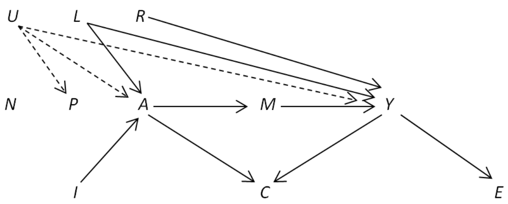

# SPPH 504-007

## Application of Epidemiological Methods

- This [PhD-level course](https://med-fom-spph.sites.olt.ubc.ca/files/2018/04/SPPH-504-007-Course-Outline-Sep-2019.pdf) teaches research trainees emerging and advanced epidemiological methods, including statistical approaches for confounding, missingness and complex surveys towards the development of analysis plans, the analyzes and interpretation of real-world epidemiologic data and the communication of findings.

## Lecture schedule

| # | Part | Topic | Lab Links | Source type |
|---|---|-----------------|------------------------------------|-------|
| 1 | 1 | Data manipulation | [Lab 1: Introduction to R](https://htmlpreview.github.io/?https://raw.githubusercontent.com/ehsanx/spph504-007/master/Lab1/lab1.html) |   HTML
| 2 | 1 | NHANES - analytic data | [Lab 2a: Creating Analytic dataset from NHANES](https://htmlpreview.github.io/?https://raw.githubusercontent.com/ehsanx/spph504-007/master/Lab2/lab2a.html) |   HTML
| 2 | 2 |  | [Lab 2b: Working with Analytic dataset](https://htmlpreview.github.io/?https://raw.githubusercontent.com/ehsanx/spph504-007/master/Lab2/lab2b.html) |   HTML
| 3 | 1 | Regression / Machine learning diagnostics | [Lab 3a: Regression diagnostics](https://htmlpreview.github.io/?https://raw.githubusercontent.com/ehsanx/spph504-007/master/Lab3/lab3a.html) |   HTML
| 3 | 2 |  | [Lab 3b: Avoiding overfitting](https://htmlpreview.github.io/?https://raw.githubusercontent.com/ehsanx/spph504-007/master/Lab3/lab3b.html) |   HTML
| 4 | 1 | Survey data analysis | [Lab 4a: Creating the analytic survey dataset](https://htmlpreview.github.io/?https://raw.githubusercontent.com/ehsanx/spph504-007/master/Lab4/lab4a.html) |   HTML
| 4 | 2 |  | [Lab 4b: Checking the analytic survey dataset](https://htmlpreview.github.io/?https://raw.githubusercontent.com/ehsanx/spph504-007/master/Lab4/lab4b.html) |   HTML 
| 4 | 3 |  | [Lab 4c: Analyzing the analytic survey dataset](https://htmlpreview.github.io/?https://raw.githubusercontent.com/ehsanx/spph504-007/master/Lab4/lab4a.html) |   HTML
| 5 | 1 | Propensity Score Matching | [Lab 5a: Matching](https://htmlpreview.github.io/?https://raw.githubusercontent.com/ehsanx/spph504-007/master/Lab5/Lab-5-0-Matching-CCHS.html) |   HTML
| 5 | 2 |  | [Lab 5b: Propensity score Matching in CCHS](https://htmlpreview.github.io/?https://raw.githubusercontent.com/ehsanx/spph504-007/master/Lab5/Lab-5-1-PSmatching-CCHS.html) |   HTML 
| 5 | 3 |  | [Lab 5c: Propensity score matching in NHANES](https://htmlpreview.github.io/?https://raw.githubusercontent.com/ehsanx/spph504-007/master/Lab5/Lab-5-2-PSMatching-NHANES.html) |   HTML
| 5 | 4 |  | [Lab 5d: Propensity score weighting (Inverse probability weighting) in NHANES](https://htmlpreview.github.io/?https://raw.githubusercontent.com/ehsanx/spph504-007/master/Lab5/Lab-5-3-PSWeighting-NHANES.html) |   HTML
| 5 | 5 |  | [Lab 5e: Estimating propensity score weighting for multiple treatments](https://htmlpreview.github.io/?https://raw.githubusercontent.com/ehsanx/spph504-007/master/Lab5/Lab-5-4-multipleTx.html) |   HTML
| 6 | 1 | Missing data analysis | [Lab 6a: Missing data and Imputation](https://htmlpreview.github.io/?https://raw.githubusercontent.com/ehsanx/spph504-007/master/Lab6/lab6part1.html) |   HTML
| 6 | 2 |  | [Lab 6b: Dealing with missing values in survey data (binary variable with missing values and binary outcome)](https://htmlpreview.github.io/?https://raw.githubusercontent.com/ehsanx/spph504-007/master/Lab6/lab6part2.html) |   HTML 
| 6 | 3 |  | [Lab 6c: Dealing with missing values in survey data (multiple variables with missing values)](https://htmlpreview.github.io/?https://raw.githubusercontent.com/ehsanx/spph504-007/master/Lab6/lab6part3.html) |   HTML
| 6 | 4 |  | [Lab 6d: Dealing with missing values in propensity score weighted analysis involving survey data](https://htmlpreview.github.io/?https://raw.githubusercontent.com/ehsanx/spph504-007/master/Lab6/lab6part4A.html) |   HTML
| 6 | 5 |  | [Lab 6e: Dealing with missing values in propensity score weighted analysis involving survey data, when weights are too large - 1](https://htmlpreview.github.io/?https://raw.githubusercontent.com/ehsanx/spph504-007/master/Lab6/lab6part4B.html) |   HTML
| 6 | 6 |  | [Lab 6f: Dealing with missing values in propensity score weighted analysis involving survey data, when weights are too large - 2](https://htmlpreview.github.io/?https://raw.githubusercontent.com/ehsanx/spph504-007/master/Lab6/lab6part6.html) |   HTML
| 6 | 7 |  | [Lab 6g: Estimating model performance from multiple imputed datasets](https://htmlpreview.github.io/?https://raw.githubusercontent.com/ehsanx/spph504-007/master/Lab6/lab6part6A.html) |   HTML
| 7 | 1 | Machine learning | [Lab 7: Machine learning and Application in Propensity Score Analysis](https://htmlpreview.github.io/?https://raw.githubusercontent.com/ehsanx/spph504-007/master/Lab7/lab7.html) |   HTML
| 8 | 1 | RMarkdown for Scientific Writing | [Lab 8: RMarkdown](https://www.youtube.com/watch?v=DWxDWyqWnX0&t=1s)  |   Video
| 9 | 1 | Regression with categorical vs. survival outcomes | [Lab 9a: Matched data](https://htmlpreview.github.io/?https://raw.githubusercontent.com/ehsanx/spph504-007/master/Lab9/lab9part1.html) |   HTML
| 9 | 2 |  | [Lab 9b: Polytomous and Ordinal Regression](https://htmlpreview.github.io/?https://raw.githubusercontent.com/ehsanx/spph504-007/master/Lab9/lab9part2.html) |   HTML 
| 9 | 3 |  | [Lab 9c: Poisson and Negative binomial regression](https://htmlpreview.github.io/?https://raw.githubusercontent.com/ehsanx/spph504-007/master/Lab9/lab9part3.html) |   HTML
| 9 | 4 |  | [Lab 9d: Survival analysis](https://htmlpreview.github.io/?https://raw.githubusercontent.com/ehsanx/spph504-007/master/Lab9/lab9part4.html) |   HTML
| 10 | 1 | Mediation Analysis | [Lab 10a: Ideas of Mediation analysis on the CCHS analytic dataset](https://htmlpreview.github.io/?https://raw.githubusercontent.com/ehsanx/spph504-007/master/Lab10/Lab-10-1-mediation.html) |   HTML
| 10 | 2 |  | [Lab 10b: Mediation analysis on the CCHS analytic dataset](https://htmlpreview.github.io/?https://raw.githubusercontent.com/ehsanx/spph504-007/master/Lab10/Lab-10-2-mediation.html) |   HTML 
| 10 | 3 |  | [Lab 10c: Mediation analysis (3 category mediator) on the CCHS analytic dataset](https://htmlpreview.github.io/?https://raw.githubusercontent.com/ehsanx/spph504-007/master/Lab10/Lab-10-3-mediation.html) |   HTML
| 10 | 4 |  | [Lab 10d: Mediation analysis using various R packages](https://htmlpreview.github.io/?https://raw.githubusercontent.com/ehsanx/spph504-007/master/Lab10/Lab-10-4-mediation.html) |   HTML
| 11 | 1 | Longitudinal Data (optional) | [Lab 11a: Mixed Effects Models](https://htmlpreview.github.io/?https://raw.githubusercontent.com/ehsanx/spph504-007/master/Lab11/lab11partA.html) |   HTML
| 11 | 2 |  | [Lab 11b: GEE](https://htmlpreview.github.io/?https://raw.githubusercontent.com/ehsanx/spph504-007/master/Lab11/lab11partB.html) |   HTML 

## References

[UBC Library Online Course Reserves](https://courses.library.ubc.ca/instructorhome/id/136279)

## Contact

- Feel free to [email](http://ehsank.com/) me for comments / suggestions.